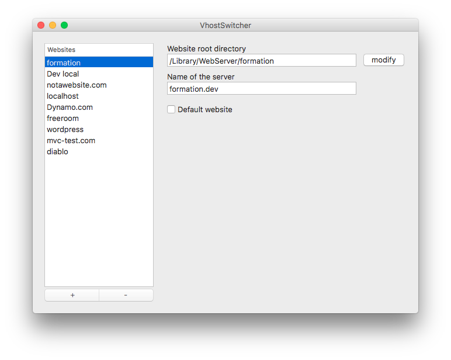

# VhostSwitcher
*This app is in development*

This app is built with **pyObjc** and helps you manage Apache virtual hosts on dev environments.
It also updates the `hosts` file for each virtual host.

*Make sure the rights of the vhost and the hosts file are set to your user if you have issues.*

## Install

### Dependencies

- pyObjc
- py2app

### Build
```
  python setup.py py2app
```

The app will be built in the dist folder
